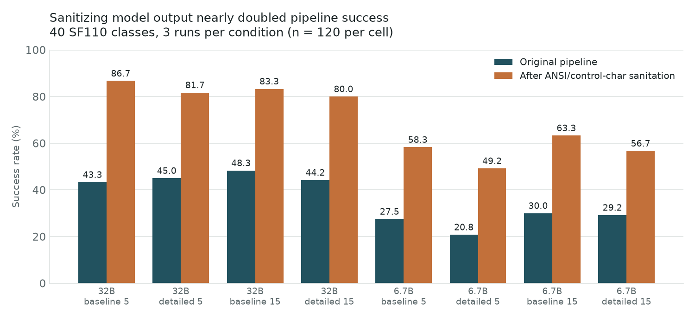
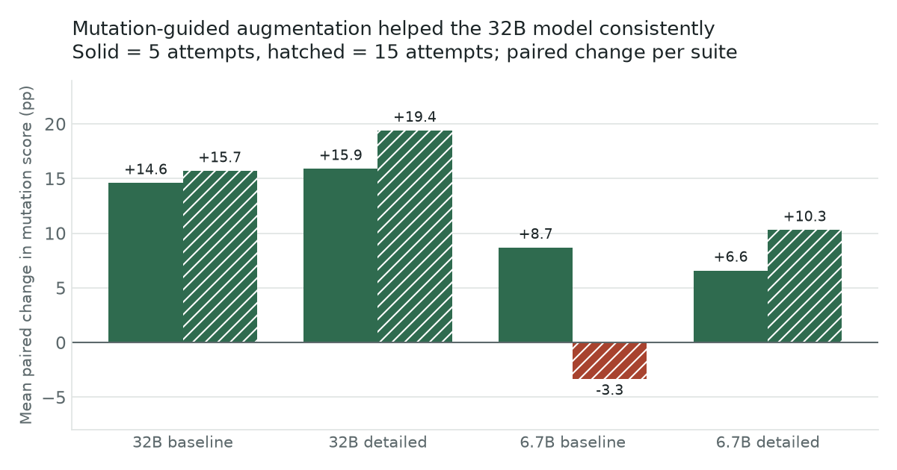
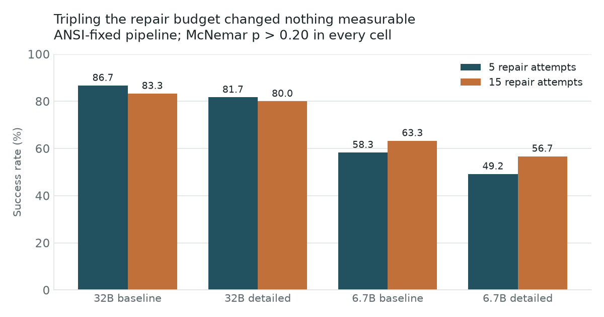

# LLM-Based Automated Unit Test Generation

End-to-end pipeline that generates JUnit 5 tests for Java classes using **locally deployed** LLMs, validates them by compiling and running them through Maven, repairs failures in an iterative loop, and measures test quality with PIT mutation testing. Nothing leaves the machine: no cloud API, no source code sent to a third party.

Evaluated on **40 Java classes from the SF110 corpus** across a 2 x 2 x 2 factorial design (model x prompt x repair budget), 3 runs per condition — **2,240 generation results from 56 run folders**.

## Results

**Sanitizing model output was worth more than every other factor tested.** Generated test files contained ANSI escape sequences and terminal control characters, which caused compilation to fail. Stripping them before writing the file nearly doubled the success rate:

| Model | Prompt | Repair budget | Original | After sanitation | Delta |
|---|---|---:|---:|---:|---:|
| Qwen2.5-Coder 32B | baseline | 5 | 43.3% | **86.7%** | +43.3 pp |
| Qwen2.5-Coder 32B | detailed | 5 | 45.0% | 81.7% | +36.7 pp |
| Qwen2.5-Coder 32B | baseline | 15 | 48.3% | 83.3% | +35.0 pp |
| Qwen2.5-Coder 32B | detailed | 15 | 44.2% | 80.0% | +35.8 pp |
| DeepSeek-Coder 6.7B | baseline | 5 | 27.5% | 58.3% | +30.8 pp |
| DeepSeek-Coder 6.7B | detailed | 5 | 20.8% | 49.2% | +28.3 pp |
| DeepSeek-Coder 6.7B | baseline | 15 | 30.0% | 63.3% | +33.3 pp |
| DeepSeek-Coder 6.7B | detailed | 15 | 29.2% | 56.7% | +27.5 pp |

All eight cells improved by at least +27.5 pp, and every cell held up after Holm-Bonferroni correction (Wilcoxon, p < 0.001; per-run McNemar, p < 0.05). Prompt variation moved success by only 3-9 pp — the sanitation fix was roughly 3 to 14 times larger.



**Mutation-guided augmentation raised test effectiveness for the 32B model.** Feeding surviving mutants back to the model and asking for extra test methods improved mean PIT mutation scores by **+14.6 to +19.4 pp** across the four 32B conditions, with no suite scoring worse than it started. The 6.7B model responded inconsistently (+6.6 to +10.3 pp in three cells, -3.3 pp in one, driven by run-to-run variance).



**Two things that did not work**, reported because negative results are part of the finding:

- Extending the repair budget from 5 to 15 attempts produced no statistically detectable effect in any condition (McNemar p > 0.20 in every cell).

  
- Neither a simplified "guided-lite" prompt nor reusing the last successful test as context beat its matched comparator (+1.6 pp and -1.6 pp, both inside run-to-run variance).

Every number above is reproducible from [`data/`](data/): `grand_summary.md` holds the condition-level tables, `grand_cut_level_results.csv` the raw per-class results from all 56 run folders, and the `grand_*_per_run.csv` files the run-level breakdowns.

## How the ANSI problem was found

Under the original pipeline no condition exceeded 50% success, which looked like a model-capability limit and matched prior work reporting 34-62% syntactically invalid LLM-generated tests. That reading was wrong.

Classifying every failure by category showed `repair_exceeded` accounting for 95-99% of failures in the 32B cells — the repair loop was running out of attempts rather than hitting a design problem. Inspecting the rejected files showed why: hidden terminal control characters were being written into the `.java` files, so compilation failed for reasons that had nothing to do with test design, and the repair loop kept trying to fix code that was already correct.

Adding a post-processing step to strip those characters changed both the success rate and the shape of the residual failures: after the fix, 6.7B failures spread across several modes (`repair_exceeded` 28-66%, `repair_validation_fail` 17-49%, `mvn_no_parse` 12-20%) instead of piling into one.

## Pipeline

1. **Generate** — prompt a local model served by Ollama (Qwen2.5-Coder 32B or DeepSeek-Coder 6.7B, both Q4-quantised) for a JUnit 5 test class
2. **Sanitize** — strip ANSI and control characters before the file is written
3. **Validate** — compile and run through Maven and Surefire
4. **Repair** — parse the failure output and re-prompt, up to the configured budget
5. **Assess** — run PIT mutation analysis on the passing suite
6. **Augment** — feed surviving mutants back to the model for additional test methods, then re-measure

Evaluation ran on NVIDIA A6000 / A40 GPUs (48 GB VRAM). The Python pipeline uses only the standard library at runtime.

## Repository layout

```
llm-testgen-project/
├── testgen-runner/        Python pipeline (generation, validation, repair, augmentation)
│   ├── runner.py             main pipeline (single-CUT entry point)
│   ├── batch_runner.py       batch orchestrator across all CUTs
│   ├── mutant_summary.py     PIT XML report parser
│   ├── prompts/              six prompt templates (Appendix A of the thesis)
│   ├── config/config.json    runtime configuration
│   ├── tests/test_parser.py  unit tests for the Maven failure parser
│   └── start_verified_batch.ps1  Windows preflight + launch script
├── testgen-lab/           Maven project under test (40 SF110-derived CUTs)
│   ├── pom.xml              JUnit 5, Surefire, JaCoCo, PIT plugins
│   └── src/main/java/...    the 40 classes under test
├── original/              Pre-ANSI-fix snapshot of the pipeline (kept for reference)
├── LAB_PC_SETUP_AND_RUN_GUIDE.md   step-by-step setup checklist
└── README.md              this file
```

## Prerequisites

| Tool | Version | Purpose |
| --- | --- | --- |
| Python | 3.10+ | runs the pipeline |
| Java JDK | 17 | compiles and runs the CUTs and generated tests |
| Apache Maven | 3.9.x | build, test, mutation analysis |
| Ollama | latest | local LLM serving |

The Python code uses **only the standard library** at runtime (see
`testgen-runner/requirements.txt`). No `pip install` is required for the pipeline
itself; pytest is optional for the test suite.

Pull at least one model with Ollama:

```powershell
ollama pull qwen2.5-coder:32b      # used in the main study
ollama pull deepseek-coder:6.7b    # 6.7B variant for the small-model conditions
```

## Quick start (single CUT)

1. Edit `testgen-runner/config/config.json`:
   - `project_root` → path to your local `testgen-lab` (use forward slashes on Windows)
   - `mvn_cmd` → either `mvn` (if Maven is on `PATH`) or the absolute path to `mvn.cmd`
2. From the `testgen-runner/` directory:
   ```powershell
   python runner.py
   ```
   This generates a test for the CUT named in `cut_path`, validates it with
   Maven, runs the repair loop on failures, then runs PIT mutation analysis.

## Batch run (all 40 CUTs)

```powershell
cd testgen-runner
python batch_runner.py            # full sweep
python batch_runner.py --only Region   # single CUT
python batch_runner.py --dry-run       # show what would run
```

Results appear in `testgen-runner/output/`:

| File / folder | Contents |
| --- | --- |
| `batch_results.txt` | one line per CUT: status, repair count, mutation scores, failure category |
| `generated_tests/` | the final test class for each CUT |
| `summary/` | aggregated success and mutation-score summaries |
| `logs/` | per-CUT Maven, Ollama, and repair logs |

## Reproducing thesis conditions

Configure `config.json` per the variants in
`LAB_PC_SETUP_AND_RUN_GUIDE.md` (section 7), then run `batch_runner.py`. The
2 × 2 × 2 factorial design (model × prompt × repair budget) is reproduced by
swapping `model`, `generation_profile`, and `max_repair_attempts`.

| Condition | `model` | `generation_profile` | `max_repair_attempts` |
| --- | --- | --- | --- |
| 32B baseline 5 | `qwen2.5-coder:32b` | `baseline_behavior` | 5 |
| 32B detailed 5 | `qwen2.5-coder:32b` | `detailed_behavior` | 5 |
| 32B baseline 15 | `qwen2.5-coder:32b` | `baseline_behavior` | 15 |
| 32B detailed 15 | `qwen2.5-coder:32b` | `detailed_behavior` | 15 |
| 6.7B baseline 5 | `deepseek-coder:6.7b-base-q4_K_M` | `baseline_behavior` | 5 |
| 6.7B detailed 5 | `deepseek-coder:6.7b-base-q4_K_M` | `detailed_behavior` | 5 |
| 6.7B baseline 15 | `deepseek-coder:6.7b-base-q4_K_M` | `baseline_behavior` | 15 |
| 6.7B detailed 15 | `deepseek-coder:6.7b-base-q4_K_M` | `detailed_behavior` | 15 |

For full machine-by-machine instructions (preflight, JDK pinning, multi-PC
runs) see `LAB_PC_SETUP_AND_RUN_GUIDE.md`.

## Running the unit tests

From `testgen-runner/`:

```powershell
python -m unittest tests.test_parser -v
```

This exercises the Maven-output failure parser used by `runner.py`.

## Mapping to the thesis

| Thesis section | Code in this repo |
| --- | --- |
| 3.1 Pipeline overview (Figure 1) | `runner.py` (orchestration), `batch_runner.py` |
| 3.2 Test generation + prompt profiles | `prompts/baseline_behavior.txt`, `prompts/detailed_behavior.txt` |
| 3.3 Compilation and execution validation | `runner.py: parse_surefire_failures` |
| 3.4 Iterative repair loop | `runner.py: _run_repair_loop` |
| 3.4.1 Repair-budget rationale (5 vs 15) | `config.json: max_repair_attempts` |
| 3.5 Mutation-guided augmentation | `runner.py: _run_mutation_augmentation`, `prompts/mutation_augment.txt` |
| 3.6 Experimental setup (40 CUTs) | `testgen-lab/src/main/java/`, `config/config.json` |
| Appendix A (full prompts) | `prompts/` |

## Notes

- This repository accompanies the BSc Computer Science & AI dissertation *Automated Test Generation for Existing Code using Large Language Models* (University of Sussex, 2026).
- The `original/` directory keeps a snapshot of the pipeline **before** the
  ANSI/control-character sanitation fix (the headline finding of Chapter 4).
  It is provided for reproducibility of the pre-fix numbers reported in
  Section 4.1; the active pipeline is the top-level `testgen-runner/`.
- All evaluation was carried out on RunPod GPU instances (NVIDIA A6000 / A40,
  48 GB VRAM each). The pipeline runs unchanged on a workstation-grade local
  GPU, but inference latency will differ.
- License terms for SF110, the model checkpoints, JUnit, Maven, Surefire,
  JaCoCo, PIT, and Ollama are summarised in the dissertation
  ("Professional Considerations" section).
